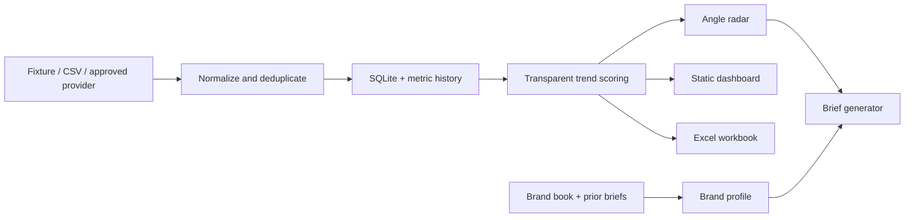

# Viral Angle Radar

Daily trend intelligence for short-form creative teams. The MVP collects verified source links, stores metric snapshots, scores rising angles, matches them to brand context, generates quick briefs, publishes a static dashboard, and exports Excel.

## Quick start

```bash
python3 -m viral_radar daily --fixture
python3 -m http.server 8080 --directory site
```

Open `http://localhost:8080`.

## Commands

```bash
python3 -m viral_radar discover --fixture
python3 -m viral_radar discover --csv data/manual_sources.csv
python3 -m viral_radar score
python3 -m viral_radar ingest-brand --brand demo-skincare
python3 -m viral_radar brief --brand demo-skincare --product "Barrier Serum"
python3 -m viral_radar export-site
python3 -m viral_radar export-excel
python3 -m viral_radar daily --fixture
```

## Live data

The repository deliberately does not bypass TikTok login, CAPTCHA, rate limits, or access controls. Add a legitimate provider in `viral_radar/providers.py` and configure its credentials through GitHub Actions secrets. Manual research can be imported with `data/manual_sources.csv`.

Every row records its provider, collection time, evidence status, and original URL. Missing metrics remain blank. Fixture records are visibly labeled and cannot be treated as live evidence.

## Brand context

Create `brands/<slug>/` and add:

- `brand_profile.json` for approved positioning, audience, tone, claims, prohibited claims, proof points, and CTA preferences.
- `.md`, `.txt`, `.csv`, `.docx`, or `.pdf` source documents.
- Prior briefs with `prior` in the filename.

Run `python3 -m viral_radar ingest-brand --brand <slug>`. PDF and DOCX extraction are optional and use `pypdf` and `python-docx` when installed. Extracted claims are never automatically promoted to approved claims.

## Scoring

The 0–100 score is auditable:

- 30% metric velocity
- 20% engagement quality
- 15% recency
- 20% category/market/format relevance
- 10% angle novelty
- 5% evidence quality

With only one snapshot, velocity is marked `insufficient_history` and receives a conservative provisional value.

## GitHub Pages and daily update

1. Create a GitHub repository and push this project.
2. In repository settings, set Pages source to **GitHub Actions**.
3. Run the **Daily Viral Angle Radar** workflow manually once.
4. Add provider/API secrets only when a legitimate provider is ready.

The workflow runs daily at 01:15 UTC, uploads the Excel workbook, and deploys `site/` to GitHub Pages. Change the cron in `.github/workflows/daily-update.yml` if needed.

## Architecture



## Limitations

- The repository ships without a live TikTok credential.
- Caption evidence is not treated as a verbatim spoken transcript.
- Creator location must be supported by profile/provider evidence; accent or appearance is not evidence.
- The deterministic brief generator works offline. An optional LLM adapter can be added without changing stored schemas.

