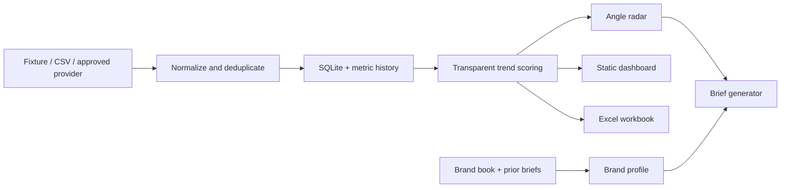

# CoBa's Daughter Opportunity Radar

Daily TikTok intelligence for CoBa's Daughter bodycare and Q4 gifting. The tool benchmarks viral gifting campaigns, scores their fit against the brand book and Q4 priorities, generates quick briefs, publishes a static dashboard, and exports Excel.

The shared dashboard also includes an evergreen **Routine Integration** lane and a **Creator Discovery** queue. Routine Integration separates voice-over reviews from trendy-music edits and explicitly distinguishes an evergreen execution reference from viral proof. Creator Discovery favors verified-US micro-creators, scores routine/candid/viral potential, requires a three-post audit before shortlist approval, and labels any likelihood of a rate at or below $200 as an unconfirmed planning estimate.

The Brief Builder includes three distinct Q4 products: the Exfoliate & Nourish 3-Piece Set, the Scrub & Soothe 7-Piece Set, and the Bath & Body 7-Piece Gift Basket. Each selection carries its own official product link, contents, packaging proof and creator direction.

Each strategic angle has its own viral creative playbook: psychological engine, recommended TikTok-native format, first frame, story beats, edit rhythm and hooks. The dashboard also carries a dated US sound snapshot in `data/trending_sounds.json`. Sound suggestions are inspiration, not a promise of virality; branded and paid content must verify availability and commercial usage rights on the posting date.

## Trend alerts and Slack

The daily run compares each format and qualified creator shortlist with its prior snapshot and suppresses repeat notifications. A Slack alert is created only when a format appears across at least two viral-qualified creator posts, gains at least two new qualifying examples, newly crosses the Breakout/Mega threshold, or a verified-US creator becomes shortlist-ready after a three-post audit. The message includes the format or creator, evidence and dashboard link.

To enable delivery, create a Slack Incoming Webhook for the intended channel and save it as the GitHub Actions repository secret `SLACK_WEBHOOK_URL`. The webhook value is never stored in the repository. `RADAR_DASHBOARD_URL` controls the link in the notification.

## Quick start

```bash
python3 -m viral_radar daily
python3 -m http.server 8080 --directory site
```

Open `http://localhost:8080`.

For a quick offline preview, run the daily command once and then open
`web/static/index.html` directly. The generated `data.js` bundle allows the
dashboard to work through a local `file://` URL as well as on GitHub Pages.

## Commands

```bash
python3 -m viral_radar discover --fixture
python3 -m viral_radar discover --csv data/manual_sources.csv
python3 -m viral_radar score
python3 -m viral_radar ingest-brand --brand cobas-daughter
python3 -m viral_radar brief --brand cobas-daughter --product "Bath & Body Care Gift Set"
python3 -m viral_radar export-site
python3 -m viral_radar export-excel
python3 -m viral_radar daily --fixture
```

## Live data

The repository deliberately does not bypass TikTok login, CAPTCHA, rate limits, or access controls. Add a legitimate provider in `viral_radar/providers.py` and configure its credentials through GitHub Actions secrets. Manual research can be imported with `data/manual_sources.csv`.

Every row records its provider, collection time, evidence status, and original URL. Missing metrics remain blank. Fixture records are visibly labeled and cannot be treated as live evidence.

## Brand context

Create `brands/<slug>/` and add:

- `brand_profile.json` for approved positioning, audience, tone, claims, prohibited claims, proof points, and CTA preferences.
- `.md`, `.txt`, `.csv`, `.docx`, or `.pdf` source documents.
- Prior briefs with `prior` in the filename.

Run `python3 -m viral_radar ingest-brand --brand <slug>`. PDF and DOCX extraction are optional and use `pypdf` and `python-docx` when installed. Extracted claims are never automatically promoted to approved claims.

## Viral qualification and taxonomy

A post is a viral benchmark only when it has **at least 10,000 likes or 1,000,000 views**. Breakout means 100,000 likes or 3,000,000 views; Mega means 1,000,000 likes or 10,000,000 views. Below-threshold posts stay in the Watchlist and are excluded from angle rankings and brief evidence.

The research hierarchy is:

1. Campaign territory — the large gifting platform.
2. Strategic angle — the repeatable creative argument.
3. Hook — the specific opening line.
4. Execution — talking head, build-with-me, carousel, unboxing, or another format.

## Opportunity scoring

The 0–100 opportunity score is auditable, but it is applied separately from viral qualification:

- 25% trend momentum (velocity, engagement, recency and novelty)
- 30% CoBa's Daughter brand fit
- 25% Q4 potential
- 15% gifting keyword relevance
- 5% evidence quality

Brand fit checks bodycare ritual, sensorial luxury, gift-object value and product match. Q4 checks the four planning pillars—Gift Guide, Aesop Alternative, Keepsake and Occasion—plus seasonal intent. With only one snapshot, velocity is marked `insufficient_history` and remains conservative. A high opportunity score can never promote a Watchlist post into the viral leaderboard.

The public dashboard intentionally excludes internal revenue, AOV and channel-performance figures from the supplied Q4 plan.

## Creator discovery method

- Best micro band: 5K–50K followers; up to 100K can remain in the research queue.
- Verify location from a public profile or credible provider. Never infer it from voice or appearance.
- Audit at least three comparable recent posts before a creator can become shortlist-ready.
- Assess voice-over fit, music-edit fit, candidness, viral evidence and ad saturation separately.
- Keep private contact details out of the public dataset; store only the contact-route status.
- Treat budget likelihood as an estimate until deliverables, usage rights and an actual quote are confirmed.

## GitHub Pages and daily update

1. Create a GitHub repository and push this project.
2. In repository settings, set Pages source to **GitHub Actions**.
3. Run the **Daily Viral Angle Radar** workflow manually once.
4. Add provider/API secrets only when a legitimate provider is ready.

The workflow runs daily at 01:15 UTC, uploads the Excel workbook, and deploys `site/` to GitHub Pages. Change the cron in `.github/workflows/daily-update.yml` if needed.

## Architecture



## Limitations

- The repository ships without a live TikTok credential.
- Caption evidence is not treated as a verbatim spoken transcript.
- Creator location must be supported by profile/provider evidence; accent or appearance is not evidence.
- The deterministic brief generator works offline. An optional LLM adapter can be added without changing stored schemas.
